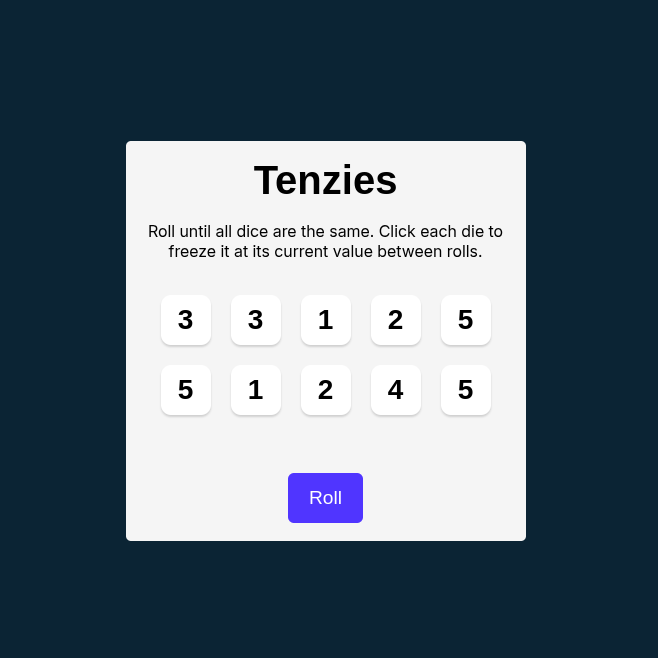
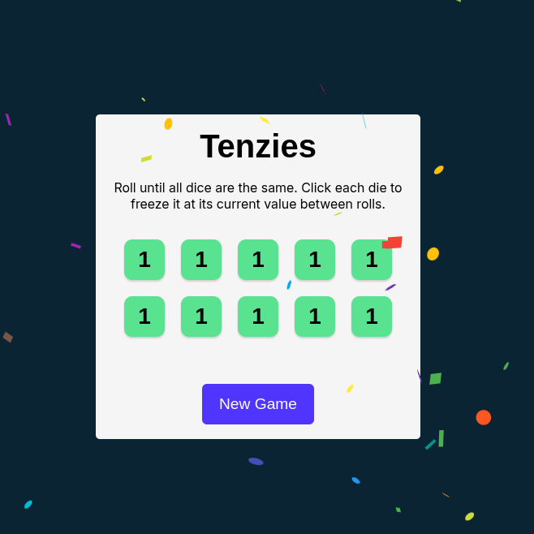

# 🎲 Capstone Project #1 - Tenzies

Bienvenue dans le dépôt de **Tenzies**, un projet réalisé dans le cadre du cours [Learn React for Beginners](https://scrimba.com/learn-react-c0e) de Scrimba qui contient 15.1 heures de contenu et 355 challenges. Ce projet est une application interactive construite pour renforcer ses compétences en React en créant un jeu simple et amusant.

## 📜 Description

**Tenzies** est un jeu où le but est de verrouiller tous les dés pour qu’ils affichent le même nombre. Vous pouvez relancer les dés non verrouillés autant de fois que nécessaire, jusqu’à ce que vous atteigniez votre objectif. Ce projet met en pratique les concepts fondamentaux de React, notamment :
- Les composants
- Les hooks (`useState`, `useEffect`, `useRef`, etc.)
- La gestion des états locaux
- L’interactivité avec utilisateur
- L'accèsibilité
- etc.

## 🚀 Fonctionnalités

- **Lancer les dés** : Cliquez pour relancer les dés non verrouillés.
- **Verrouillage des dés** : Cliquez sur un dé pour le verrouiller ou le déverrouiller.
- **Victoire** : Gagnez lorsque tous les dés sont verrouillés et affichent le même nombre.

## 🛠️ Technologies utilisées

- **React** : Framework JavaScript pour construire des interfaces utilisateur.
- **CSS** : Pour styliser l'application.
- **JavaScript** : Langage utilisé pour la logique du jeu.

## 📦 Installation

1. Clonez le dépôt :
   ```bash
   git clone https://github.com/KreeZeG123/tenzies-react.git
   cd tenzies-react
   ```

2. Installez les dépendances :
   ```bash
   npm install
   ```

3. Lancez l'application :
   ```bash
   npm run dev
   ```

4. Ouvrez la page en localhost indiquée dans votre navigateur pour voir l'application.

## ✨ Aperçu





## 📄 Licence

Ce projet est sous licence MIT - voir la licence ci-dessous pour plus de détails.

```
MIT License

Copyright (c) 2025 MANFALOTI Yamis

Permission is hereby granted, free of charge, to any person obtaining a copy
of this software and associated documentation files (the "Software"), to deal
in the Software without restriction, including without limitation the rights
to use, copy, modify, merge, publish, distribute, sublicense, and/or sell
copies of the Software, and to permit persons to whom the Software is
furnished to do so, subject to the following conditions:

The above copyright notice and this permission notice shall be included in all
copies or substantial portions of the Software.

THE SOFTWARE IS PROVIDED "AS IS", WITHOUT WARRANTY OF ANY KIND, EXPRESS OR
IMPLIED, INCLUDING BUT NOT LIMITED TO THE WARRANTIES OF MERCHANTABILITY,
FITNESS FOR A PARTICULAR PURPOSE AND NONINFRINGEMENT. IN NO EVENT SHALL THE
AUTHORS OR COPYRIGHT HOLDERS BE LIABLE FOR ANY CLAIM, DAMAGES OR OTHER
LIABILITY, WHETHER IN AN ACTION OF CONTRACT, TORT OR OTHERWISE, ARISING FROM,
OUT OF OR IN CONNECTION WITH THE SOFTWARE OR THE USE OR OTHER DEALINGS IN THE
SOFTWARE.
```
